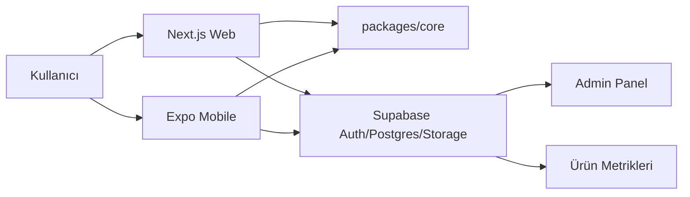

# Mimari

## Ürün Tipi

Bu ürün üç yüzeyden oluşur:

- Web: SEO, onboarding, ödeme, admin ve işveren ekranları
- Mobil: hızlı profil, plan takibi, bildirim, başvuru görevleri
- Admin: şehir, iş rotası, kurs, ilan kaynağı ve destek içeriklerini yönetme

## Seçilen Stack

### Web

Next.js kullanılacak. Locale bazlı rota yapısı `/tr`, `/en`, `/ar`, `/de` gibi çalışır. İlk aşamada web uygulaması ana ödeme ve kullanıcı hesabı yüzeyi olur.

### Mobil

Expo / React Native kullanılacak. Tek mobil kod tabanı iOS ve Android'e çıkar. Bildirimler, cihaz dili, kamera ile belge/CV tarama ve offline plan desteği sonraki aşamalarda eklenir.

### Veritabanı

Supabase / Postgres kullanılacak.

- Kullanıcı hesabı: Supabase Auth
- Kişisel veriler: Postgres + Row Level Security
- CV ve dosyalar: Supabase Storage
- Güvenli backend işleri: Supabase Edge Functions veya Next.js API routes
- Uzak erişim: Supabase Dashboard + GitHub repo + deploy ortamları

### Ortak Mantık

`packages/core` içinde rota motoru, skor hesaplama ve 30 günlük plan üretimi tutulur. Aynı motor hem web hem mobil tarafından kullanılır.

### Dil Sistemi

`packages/i18n` içinde dil listesi ve çeviri dosyaları tutulur. İlk diller:

- Türkçe
- İngilizce
- Arapça
- Almanca
- İspanyolca
- Fransızca
- Rusça
- Portekizce
- Hintçe

Dil dosyaları insan kontrolünden geçmeden üretime alınmamalı. Kariyer ve hukuki destek metinlerinde yanlış çeviri güven kaybı yaratır.

## Veri Akışı

## Ana Modüller

- Profil: şehir, dil, eğitim, cihaz, zaman, hedef, kısıtlar
- Rota motoru: gelir rotası skoru, beceri boşluğu, başlangıç planı
- Başvuru: CV özeti, başvuru mesajı, takip listesi
- Öğrenme: kurs, mikro görev, beceri kontrolü
- Ödeme: CV paketi, 30 gün takip, işveren paketi
- İşveren: aday havuzu ve yönlendirme
- Admin: içerik, şehir ve rota yönetimi
- Güvenlik: RLS, audit log, hassas veri azaltma

